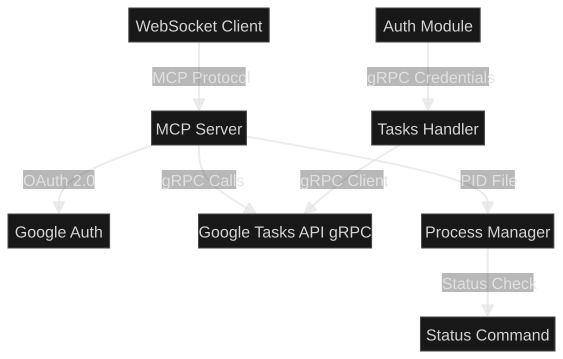

# MCP Google Tasks Server

An MCP (Model Context Protocol) server that runs as a WebSocket server, allowing clients to publish tasks to Google Tasks via the Google Tasks API using gRPC.




## Purpose

This server provides a WebSocket-based interface for managing Google Tasks through the Model Context Protocol. It enables AI agents and other clients to create, list, update, and delete tasks in Google Tasks task lists using gRPC for efficient communication with Google's APIs.

## Prerequisites
[](https://nodejs.org/)
- Node.js v22 (see `.nvmrc`)
- npm
- Google Cloud Project with Google Tasks API enabled
- OAuth 2.0 credentials (Client ID and Client Secret)

## Installation

1. Clone the repository:
   ```bash
   git clone <repository-url>
   cd mcp-gcal-task
   ```

2. Install dependencies:
   ```bash
   npm install
   ```

3. Build the project:
   ```bash
   npm run build
   ```

4. Set up environment variables (see Configuration section below)

## Configuration

Create a `.env` file in the project root with the following variables:

```env
GOOGLE_CLIENT_ID=your_client_id_here
GOOGLE_CLIENT_SECRET=your_client_secret_here
GOOGLE_REDIRECT_URI=http://localhost:3000/oauth2callback
WEBSOCKET_PORT=8080
PID_FILE_PATH=./.pid
```

### Obtaining Google OAuth Credentials

1. Go to the [Google Cloud Console](https://console.cloud.google.com/)
2. Create a new project or select an existing one
3. Enable the Google Tasks API
4. Go to "APIs & Services" > "Credentials"
5. Create OAuth 2.0 Client ID credentials
6. Set the redirect URI to match your `GOOGLE_REDIRECT_URI`
7. Copy the Client ID and Client Secret to your `.env` file

## Available Commands

### Start Server

Start the MCP server:

```bash
npm start
```

The server will:
- Start listening on the WebSocket port (default: 8080)
- Write a PID file for process management
- Accept MCP protocol connections over WebSocket

### Stop Server

Stop the running server gracefully:

```bash
npm run stop
```

This command will:
- Send SIGTERM to the server process
- Wait for graceful shutdown
- Clean up the PID file

### Check Status

Check if the server is running:

```bash
npm run status
```

**Status Output:**
- `running` (displayed in **green**) - Server is running
- `stopped` (displayed in **yellow**) - Server is not running

### Development

Run the server in development mode with TypeScript:

```bash
npm run dev
```

### Build

Compile TypeScript to JavaScript:

```bash
npm run build
```

## Available Tools

The server exposes the following MCP tools:

### `create_task`

Create a new task in a Google Tasks task list.

**Parameters:**
- `tasklist` (required): The ID of the task list
- `title` (required): The title of the task
- `notes` (optional): Notes for the task
- `status` (optional): Task status (`needsAction` or `completed`)
- `due` (optional): Due date in ISO 8601 format

### `list_tasklists`

List all task lists for the authenticated user.

**Parameters:** None

### `list_tasks`

List tasks in a specific task list.

**Parameters:**
- `tasklist` (required): The ID of the task list
- `showCompleted` (optional): Whether to show completed tasks
- `maxResults` (optional): Maximum number of results to return

### `update_task`

Update an existing task.

**Parameters:**
- `tasklist` (required): The ID of the task list
- `taskId` (required): The ID of the task to update
- `title` (optional): New title for the task
- `notes` (optional): New notes for the task
- `status` (optional): New status (`needsAction` or `completed`)

### `delete_task`

Delete a task from a task list.

**Parameters:**
- `tasklist` (required): The ID of the task list
- `taskId` (required): The ID of the task to delete

## Usage Examples

### Connecting via WebSocket

Connect to the server at `ws://localhost:8080` (or your configured port) and use the MCP protocol to call tools.

### Example: Create a Task

```json
{
  "jsonrpc": "2.0",
  "id": 1,
  "method": "tools/call",
  "params": {
    "name": "create_task",
    "arguments": {
      "tasklist": "@default",
      "title": "Complete project documentation",
      "notes": "Write comprehensive README and API docs",
      "status": "needsAction"
    }
  }
}
```

## Architecture

The server uses:
- **WebSocket** for MCP protocol transport
- **gRPC** for communication with Google Tasks API
- **OAuth 2.0** for authentication
- **PID file** for process management

## Development Setup

1. Install dependencies: `npm install`
2. Copy `.env.example` to `.env` and configure
3. Run in development mode: `npm run dev`
4. Build for production: `npm run build`

## Troubleshooting

### Server won't start

- Check that all required environment variables are set
- Verify Google OAuth credentials are correct
- Ensure the WebSocket port is not already in use

### Authentication errors

- Verify your Google OAuth credentials
- Check that the Google Tasks API is enabled in your Google Cloud project
- Ensure the redirect URI matches your configuration

### Status shows "stopped" but server is running

- Check if the PID file exists and contains the correct process ID
- Manually remove the PID file if it's stale: `rm .pid`

## License

[](https://opensource.org/licenses/MIT)

